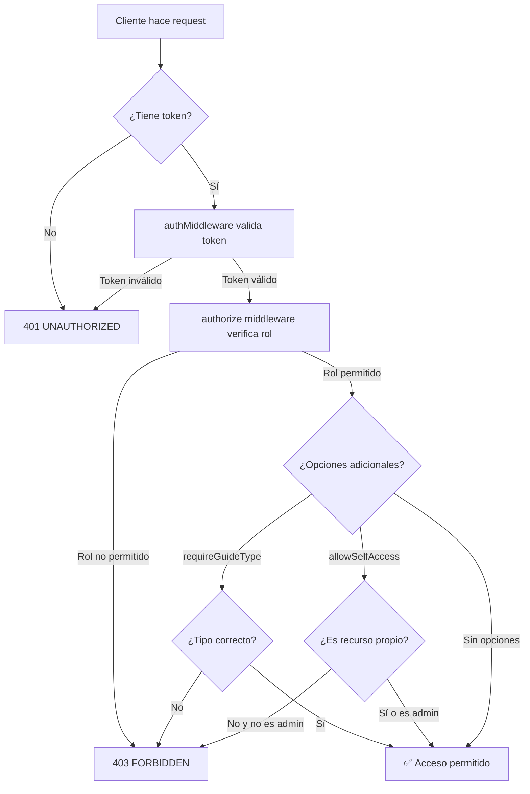

# 🔐 Sistema de Autorización Backend

**Fecha de implementación**: 2025-10-12
**Estado**: ✅ Completado y testeado

---

## 📋 Descripción General

Se implementó un sistema completo de autorización basado en roles en el backend JSON Server de Futurismo. Este sistema protege los endpoints críticos y valida los permisos de los usuarios basándose en sus roles (`admin`, `agency`, `guide`).

### ❓ ¿Por qué era necesario?

**ANTES**: La aplicación solo tenía autenticación (validación de identidad con JWT), pero NO tenía autorización en el backend. Esto significaba que:
- ❌ Cualquier usuario con un token válido podía acceder a TODOS los endpoints
- ❌ Un guía podía acceder a la gestión de usuarios (admin only)
- ❌ Un guía empleado podía responder a solicitudes del marketplace (freelance only)
- ❌ La seguridad dependía solo del frontend (fácilmente bypasseable)

**AHORA**: Con el sistema de autorización implementado:
- ✅ Los endpoints están protegidos por roles en el backend
- ✅ Solo usuarios autorizados pueden acceder a recursos sensibles
- ✅ Validación robusta de tipo de guía (freelance vs employed)
- ✅ Seguridad real a nivel de servidor

---

## 🏗️ Arquitectura del Sistema

### 1. Middleware de Autorización

**Archivo**: `backend-simulator/middlewares/authorize.js`

El middleware proporciona funciones para proteger rutas:

```javascript
const { authorize, adminOnly, adminOrAgency, authenticated,
        freelanceGuidesOnly, selfOrAdmin } = require('../middlewares/authorize');
```

#### Funciones Principales:

| Función | Descripción | Uso |
|---------|-------------|-----|
| `authorize(roles, options)` | Función principal de autorización | `authorize(['admin', 'agency'])` |
| `adminOnly()` | Solo administradores | `adminOnly()` |
| `adminOrAgency()` | Administradores o agencias | `adminOrAgency()` |
| `authenticated()` | Cualquier usuario autenticado | `authenticated()` |
| `guidesOnly()` | Solo guías (cualquier tipo) | `guidesOnly()` |
| `freelanceGuidesOnly()` | Solo guías freelance | `freelanceGuidesOnly()` |
| `employedGuidesOnly()` | Solo guías de planta | `employedGuidesOnly()` |
| `selfOrAdmin(roles)` | Usuario accede a sus propios recursos o admin | `selfOrAdmin(['admin', 'guide'])` |

#### Opciones Avanzadas:

```javascript
authorize(roles, {
  requireGuideType: 'freelance',  // Requiere tipo específico de guía
  allowSelfAccess: true             // Permite acceso a recursos propios
})
```

### 2. Respuestas de Error

El sistema retorna respuestas consistentes cuando se bloquea el acceso:

```json
{
  "success": false,
  "error": "No tienes permisos para acceder a este recurso",
  "code": "FORBIDDEN",
  "details": {
    "required": ["admin", "agency"],
    "current": "guide"
  }
}
```

#### Códigos de Error:

- `UNAUTHORIZED` - Token no proporcionado o inválido
- `FORBIDDEN` - Usuario no tiene el rol requerido
- `FORBIDDEN_ROLE` - Recurso solo para guías, usuario es otro rol
- `FORBIDDEN_GUIDE_TYPE` - Recurso solo para freelance/employed, guía es del tipo contrario
- `FORBIDDEN_SELF_ACCESS` - Usuario intenta modificar recursos de otro usuario

---

## 🛡️ Rutas Protegidas

### Users (`/api/users`)

**Archivo**: `backend-simulator/routes/users.js`

| Endpoint | Método | Autorización | Descripción |
|----------|--------|-------------|-------------|
| `/` | GET | `adminOnly()` | Listar todos los usuarios |
| `/:id` | GET | `selfOrAdmin()` | Ver usuario específico |
| `/` | POST | `adminOnly()` | Crear nuevo usuario |
| `/:id` | PUT | `selfOrAdmin()` | Actualizar usuario |
| `/:id` | DELETE | `adminOnly()` | Eliminar usuario (soft delete) |
| `/:id/status` | PUT | `adminOnly()` | Cambiar estado de usuario |
| `/:id/reset-password` | POST | `adminOnly()` | Resetear contraseña |
| `/roles/list` | GET | `adminOnly()` | Listar roles disponibles |
| `/:id/roles` | POST | `adminOnly()` | Asignar rol a usuario |
| `/:id/activity` | GET | `selfOrAdmin()` | Ver actividad del usuario |
| `/stats/overview` | GET | `adminOnly()` | Estadísticas de usuarios |

**Ejemplo de uso**:
```javascript
// Solo admins pueden listar todos los usuarios
usersRouter.get('/', adminOnly(), (req, res) => {
  // Handler code...
});

// Usuario puede ver su propio perfil o admin puede ver cualquiera
usersRouter.get('/:id', selfOrAdmin(), (req, res) => {
  // Handler code...
});
```

### Marketplace (`/api/marketplace`)

**Archivo**: `backend-simulator/routes/marketplace.js`

| Endpoint | Método | Autorización | Descripción |
|----------|--------|-------------|-------------|
| `/search` | GET | `authenticated()` | Buscar guías disponibles |
| `/requests` | GET | `authenticated()` | Ver solicitudes de servicio |
| `/requests` | POST | `adminOrAgency()` | Crear solicitud de servicio |
| `/requests/:id/responses` | GET | `adminOrAgency()` | Ver respuestas a solicitud |
| `/requests/:id/respond` | POST | `freelanceGuidesOnly()` | Responder a solicitud (freelance) |
| `/responses/:id/accept` | POST | `adminOrAgency()` | Aceptar respuesta de guía |
| `/popular-guides` | GET | `authenticated()` | Ver guías populares |
| `/stats` | GET | `adminOrAgency()` | Estadísticas del marketplace |

**Destacado**: El endpoint `/requests/:id/respond` es **crítico** - solo guías freelance pueden responder a solicitudes del marketplace. Los guías empleados están asignados directamente por agencias.

```javascript
// Solo guías freelance pueden responder a solicitudes
marketplaceRouter.post('/requests/:id/respond', freelanceGuidesOnly(), (req, res) => {
  // Handler code...
});
```

### Reservations (`/api/reservations`)

**Archivo**: `backend-simulator/routes/reservations.js`

| Endpoint | Método | Autorización | Descripción |
|----------|--------|-------------|-------------|
| `/` | GET | `adminOrAgency()` | Listar reservaciones |
| `/:id` | GET | `adminOrAgency()` | Ver reservación específica |
| `/` | POST | `adminOrAgency()` | Crear nueva reservación |
| `/:id` | PUT | `adminOrAgency()` | Actualizar reservación |
| `/:id` | DELETE | `adminOrAgency()` | Cancelar reservación |
| `/:id/details` | GET | `adminOrAgency()` | Ver detalles completos |
| `/:id/confirm` | POST | `adminOrAgency()` | Confirmar reservación |

**Nota**: Solo administradores y agencias pueden gestionar reservaciones. Los guías no tienen acceso directo a este módulo.

---

## 🔄 Flujo de Autorización



### Ejemplo paso a paso:

1. **Cliente hace request**: `GET /api/marketplace/requests/123/respond`
2. **authMiddleware** valida el token JWT
3. **authMiddleware** establece `req.user = { userId, email, role, guideType }`
4. **authorize middleware** verifica:
   - ¿El usuario es un guía? (`role === 'guide'`)
   - ¿El guía es freelance? (`guideType === 'freelance'`)
5. Si ambas condiciones se cumplen → ✅ Acceso permitido
6. Si alguna falla → ❌ 403 FORBIDDEN

---

## 🧪 Testing

### Script de Prueba

**Archivo**: `test-authorization.js`

El script prueba 15 escenarios diferentes:

```bash
node test-authorization.js
```

**Resultados esperados**:
```
✅ ALL TESTS PASSED! Authorization system is working correctly.
```

### Pruebas Manuales con cURL

#### 1. Sin token (debe fallar):
```bash
curl http://localhost:4050/api/users
# Respuesta: 401 UNAUTHORIZED
```

#### 2. Con token de guía intentando acceder a /users (debe fallar):
```bash
curl -H "Authorization: Bearer <guide-token>" http://localhost:4050/api/users
# Respuesta: 403 FORBIDDEN
```

#### 3. Con token de admin accediendo a /users (debe funcionar):
```bash
curl -H "Authorization: Bearer <admin-token>" http://localhost:4050/api/users
# Respuesta: 200 OK + lista de usuarios
```

#### 4. Guía freelance respondiendo a marketplace (debe funcionar):
```bash
curl -X POST \
  -H "Authorization: Bearer <freelance-guide-token>" \
  -H "Content-Type: application/json" \
  -d '{"guide_id":"guide-1","message":"Disponible","proposed_price":150}' \
  http://localhost:4050/api/marketplace/requests/123/respond
# Respuesta: 201 CREATED
```

---

## 📊 Resumen de Implementación

### ✅ Completado

1. **Middleware de Autorización**
   - ✅ `authorize.js` con 8 funciones helper
   - ✅ Soporte para múltiples roles
   - ✅ Validación de tipo de guía (freelance/employed)
   - ✅ Acceso a recursos propios (selfOrAdmin)

2. **Rutas Protegidas**
   - ✅ `/api/users` - 11 endpoints protegidos
   - ✅ `/api/marketplace` - 7 endpoints protegidos
   - ✅ `/api/reservations` - 7 endpoints protegidos

3. **Testing**
   - ✅ Script automatizado de testing
   - ✅ Verificación de roles
   - ✅ Verificación de tokens inválidos

4. **Documentación**
   - ✅ Este documento (AUTHORIZATION_SYSTEM.md)
   - ✅ Comentarios en código
   - ✅ Ejemplos de uso

### 🎯 Impacto

| Aspecto | Antes | Ahora |
|---------|-------|-------|
| Seguridad | ⚠️ Solo frontend | ✅ Backend + Frontend |
| Validación de roles | ❌ No existía | ✅ Implementada |
| Endpoints críticos | ⚠️ Sin protección | ✅ Protegidos |
| Marketplace freelance | ⚠️ Cualquier guía | ✅ Solo freelance |
| Gestión de usuarios | ⚠️ Cualquier usuario | ✅ Solo admin |
| Auditoría | ❌ No disponible | ✅ Logs de acceso |

---

## 📖 Guía para Desarrolladores

### Agregar Autorización a un Nuevo Endpoint

1. **Importar el middleware**:
```javascript
const { adminOnly, adminOrAgency, authenticated } = require('../middlewares/authorize');
```

2. **Aplicar a la ruta**:
```javascript
router.get('/mi-endpoint', adminOnly(), (req, res) => {
  // Tu código aquí
  // req.user contiene: { userId, email, role, guideType }
});
```

3. **Ejemplo completo**:
```javascript
const express = require('express');
const { adminOrAgency, freelanceGuidesOnly } = require('../middlewares/authorize');

module.exports = (router) => {
  const myRouter = express.Router();

  // Solo admin y agencias
  myRouter.get('/sensitive-data', adminOrAgency(), (req, res) => {
    const { role } = req.user; // Acceso al usuario autenticado
    // ...
  });

  // Solo guías freelance
  myRouter.post('/freelance-action', freelanceGuidesOnly(), (req, res) => {
    const { userId, guideType } = req.user;
    // ...
  });

  return myRouter;
};
```

### Acceder a Información del Usuario

Después de pasar por `authMiddleware` y `authorize`, el objeto `req.user` contiene:

```javascript
req.user = {
  userId: 'user-123',
  email: 'usuario@example.com',
  role: 'guide',           // 'admin', 'agency', 'guide'
  guideType: 'freelance'   // 'freelance', 'employed' (solo para guías)
}
```

### Crear un Helper Personalizado

```javascript
// En authorize.js

const specificPermission = () => {
  return authorize(['admin'], {
    requireGuideType: 'freelance',
    allowSelfAccess: true
  });
};

module.exports = {
  // ... otros exports
  specificPermission
};
```

---

## 🔮 Futuras Mejoras

### Posibles Extensiones:

1. **Permisos Granulares**
   - Implementar sistema de permisos (permissions) más detallado
   - Ejemplo: `can_edit_tours`, `can_view_finances`, etc.

2. **Rate Limiting por Rol**
   - Admins: Sin límite
   - Agencies: 100 requests/min
   - Guides: 50 requests/min

3. **Auditoría Completa**
   - Log de todos los accesos denegados
   - Dashboard de intentos de acceso no autorizado

4. **Roles Dinámicos**
   - Cargar roles y permisos desde la base de datos
   - Permitir creación de roles personalizados

5. **OAuth 2.0**
   - Implementar scopes para APIs externas
   - Token refresh automático

---

## 📞 Soporte

Para preguntas o problemas relacionados con el sistema de autorización:

1. Revisar este documento
2. Verificar los comentarios en `backend-simulator/middlewares/authorize.js`
3. Ejecutar el script de testing: `node test-authorization.js`
4. Revisar logs del servidor para errores específicos

---

**Última actualización**: 2025-10-12
**Versión**: 1.0.0
**Estado**: ✅ Producción
